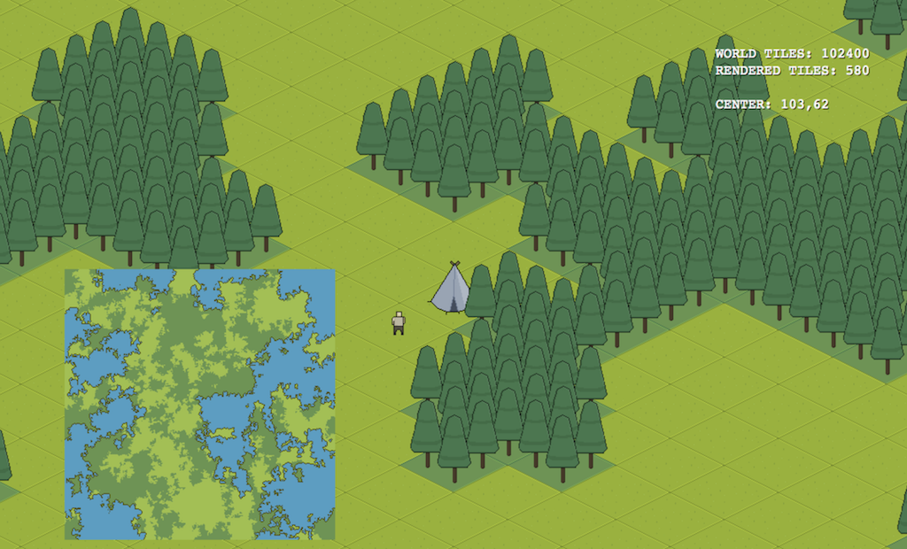

# js-procgen-world

This was my first attempt at creating a procedural generated world. Using Phasder 2/CE



## Running

The files just need to be served on any web server. Personally I use `http-server` for this

```bash
npm install http-server -g
cd ./path/to/project
http-server
```

Will get you up and running real quick. You can refresh the page to gen new worlds, player spawns at a random place and I don't think there's any collision checking so you can easily spawn in the middle of a forest